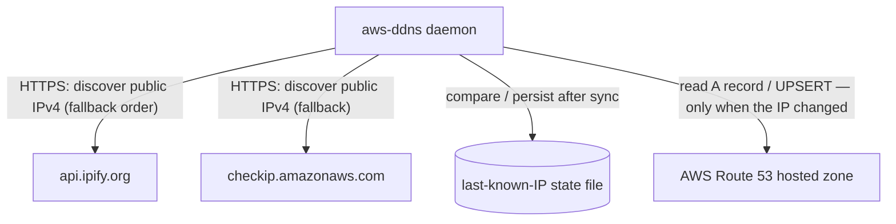

# aws-ddns

A tiny Dynamic DNS daemon that keeps an AWS Route 53 `A` record pointed at your
network's current public IPv4 — for any Docker-capable local server behind a router
with a dynamic public IP. No inbound port, no database, no router integration.

## How it works



Every `INTERVAL` (default 5 min): discover the public IPv4 over HTTPS (two endpoints,
with fallback) → compare with the locally cached last IP → **only when it changed**,
read the Route 53 record and `UPSERT` it. Failures are logged and retried next cycle;
`SIGTERM` stops it gracefully. Go standard library + AWS SDK v2, structured JSON logs
on stdout, `scratch`-based container image.

**No specific permission is needed anywhere:**

- The container runs as whatever user the engine assigns — no root requirement, no
  ownership preparation on the data folder (a startup probe logs a clear error if the
  folder is not writable).
- On AWS, one dedicated least-privilege IAM user: it can only `UPSERT` that single `A`
  record and list the zone's records — nothing else.

## How to use

### Prerequisites

- Docker or Podman on the target; Go ≥ 1.25 + `make` to build from source.
- A Route 53 hosted zone, and a dedicated IAM user:
  1. In [apps/aws-ddns/iam-policy.json](apps/aws-ddns/iam-policy.json), replace
     `HOSTED_ZONE_ID` and `RECORD_NAME` (lowercase).
  2. Create a customer-managed policy from it, a dedicated IAM user with no console
     access, attach the policy, create one access key.

  <details><summary>IAM policy sample</summary>

  ```json
  {
    "Version": "2012-10-17",
    "Statement": [
      {
        "Effect": "Allow",
        "Action": "route53:ChangeResourceRecordSets",
        "Resource": "arn:aws:route53:::hostedzone/HOSTED_ZONE_ID",
        "Condition": { "ForAllValues:StringEquals": {
          "route53:ChangeResourceRecordSetsNormalizedRecordNames": ["RECORD_NAME"],
          "route53:ChangeResourceRecordSetsRecordTypes": ["A"],
          "route53:ChangeResourceRecordSetsActions": ["UPSERT"] } }
      },
      {
        "Effect": "Allow",
        "Action": "route53:ListResourceRecordSets",
        "Resource": "arn:aws:route53:::hostedzone/HOSTED_ZONE_ID"
      }
    ]
  }
  ```

  </details>

- Configuration — two interchangeable sources (environment overrides file):
  - **`.env`** for local runs — `make init-env`, then fill in
    ([sample](.env.example)):

    ```bash
    AWS_ACCESS_KEY_ID=…
    AWS_SECRET_ACCESS_KEY=…
    HOSTED_ZONE_ID=Z0123456789ABCDEFGHIJ
    RECORD_NAME=home.example.com
    ```

  - **INI file** for servers — same keys, dropped as `aws-ddns.ini` into the app data
    folder (default `/var/lib/aws-ddns`, mounted from the host)
    ([sample](apps/aws-ddns/aws-ddns.ini.example)).

### Run locally with make

```bash
make init-env   # create .env, fill in the values
make check      # quality gate: clean → install → format → lint → build → test
make start      # run the daemon as a container (Compose); make shutdown to stop
```

### Use the public registry image

```bash
docker pull docker.io/mitchmo/aws-ddns:latest        # multi-arch: amd64 + arm64
docker run -d --name aws-ddns --restart unless-stopped \
  --read-only --cap-drop ALL \
  -v /srv/aws-ddns:/var/lib/aws-ddns \
  docker.io/mitchmo/aws-ddns:latest
```

Put your `aws-ddns.ini` in the mounted folder first. Upgrades are pull-based —
platform "update container" actions work. Publishing a new version: `make deploy`.

### Export images for local use (no registry)

```bash
make export-image
# → dist/aws-ddns-<v>-linux-{amd64,arm64}.tar.gz (+ .sha256) + dist/docker-compose.yaml
# copy to the target, then:  docker load -i <archive>  and deploy the compose file
```

Full deployment, configuration, and operations reference:
[apps/aws-ddns/README.md](apps/aws-ddns/README.md).

## FAQ

- **Container exits with no logs at all** → the process never ran. Check the
  architecture: `docker image inspect <image> --format '{{.Architecture}}'` must match
  `uname -m`; probe with `docker run --rm <image> -version`.
- **`data directory … is not writable`** → grant the container's user write access on
  the mounted host folder (or pin `user: "<uid>:<gid>"` in compose).
- **`unknown key "…"`** → typo in `aws-ddns.ini`; keys use the exact `.env` names.
- **"Update container" fails with a manifest/pull error** → offline deployments have
  no registry to pull from: recreate the container with the new tag instead — or
  switch to the registry image, where updates work.
- **Record changed externally but IP unchanged** → delete `<data-dir>/last-ip.txt` to
  force a Route 53 comparison next cycle.
- **Wrong IP discovered when testing locally** → the machine is on a VPN or a
  different gateway than the server.
- **Anything else** → set `LOG_LEVEL=debug`: every step logs to stdout with durations;
  the last line before a stop names the failing step (`docker logs aws-ddns`).

## Author

Monier R. — [MIT](LICENSE).

## Contribute

Read [`AGENTS.md`](AGENTS.md) first (rules, Definition of Done, versioning — every
change bumps `VERSION`). Run `make check` before committing. Architecture details:
[docs/architecture.md](docs/architecture.md); full technical reference:
[apps/aws-ddns/README.md](apps/aws-ddns/README.md).
