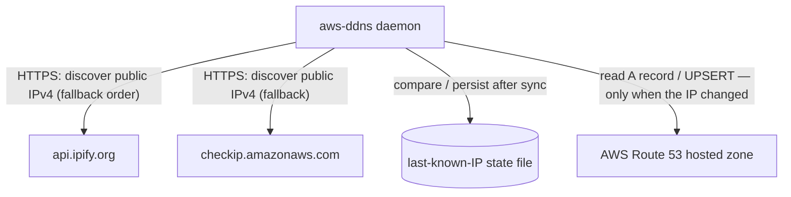

# Architecture Overview

<!-- Update this file when an app is added, removed, renamed, or when
     app interactions change. -->

## Chosen architecture per app

| App | Architecture | CQRS | Entry layer |
|---|---|---|---|
| aws-ddns | Layered | without | process |

`aws-ddns` is a headless daemon (a container-hosted background service): its only entry layer
is `process` — the supervised synchronization loop. There is no `commands` surface beyond a
`-version` flag, no HTTP surface, and no inbound port. The layer specification is
`.agents/context/architectures/layered.md`.

## Apps and interactions

## Data flow

Every cycle (at startup, then every `INTERVAL`):

1. Discover the current public IPv4 over HTTPS — first endpoint that answers with a valid
   IPv4 wins; the others are fallbacks.
2. Compare it with the locally cached last synchronized IP (`<data-dir>/last-ip.txt`). If they
   match, the cycle ends — Route 53 is not queried. Exception: the first cycle after
   startup always proceeds to Route 53 whatever the cache holds, so a restart forces a
   full reconciliation.
3. Otherwise read the configured `A` record from the hosted zone; if it is missing or holds
   a different address, `UPSERT` it with the configured `TTL`.
4. Persist the address to the state file (only after a successful check/update — a failed
   upsert is never cached, so it is retried next cycle).
5. Log the outcome; transient failures — including an unreadable/unwritable state file —
   are logged and the loop keeps running.

Configuration is merged from defaults, then `<data-dir>/aws-ddns.ini` (production), then
environment variables (local development). The app data folder (`-data-dir` /
`DATA_DIR`, default `/var/lib/aws-ddns`) holds both the INI and the state file and is
verified read/write at startup — see `.agents/context/stacks/go.md`.
